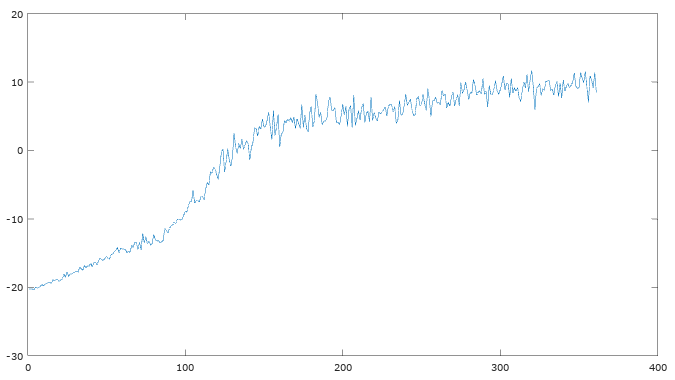

# About this example

In this example, we train a neural network on the Pong-v0 environment in OpenAI Gym.

After about a day on a GPU, this gets to the point of winning by a decent margin. This is after about 270 iterations: [demo video](https://www.youtube.com/watch?v=vbyOnjtJthA).

Here is a graph of mean reward (y-axis) over the course of training. The x-axis is the iteration number.

