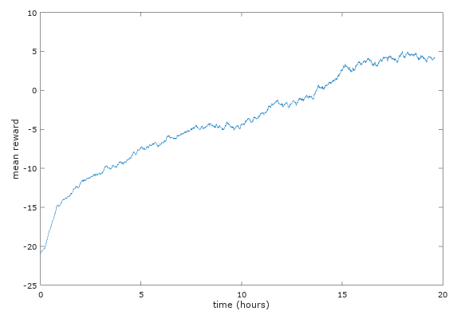

# About this example

This example uses A3C to learn to play Pong. I haven't spent too much time tinkering with the hyper-parameters, but the current version does work decently well.

Here is a [video of a trained network](https://www.youtube.com/watch?v=5m1_nK2opuQ). The network wins by an average of 4.5 points.

I tested this by running the program for ~20 hours on a high-end Intel Core i7 processor. Here is the learning curve from training:

